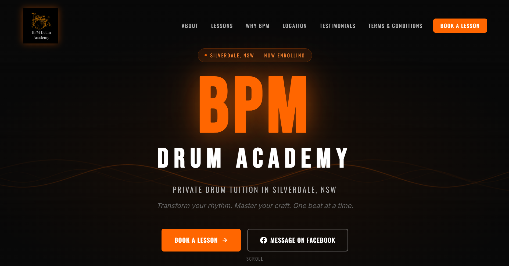

# BPM-Drum-Academy
BPM Drum Academy is a modern drum tuition studio providing private drum lessons for students of all ages and skill levels. Lessons are designed to help students build confidence, develop technique, and achieve their musical goals in a fun and supportive environment.

🥁 Live Website

https://bpmdrumacademy.com.au/

🎵 Services

Private drum lessons
Beginner to advanced tuition
Children's drum lessons
Adult drum lessons
Exam preparation
Performance coaching

🛠 Tech Stack

HTML
CSS
JavaScript

📸 Preview

📩 About

This website was developed for BPM Drum Academy to showcase its drum tuition services, provide information for prospective students, and streamline lesson enquiries and enrolments. The site focuses on a clean user experience, modern design, and mobile responsiveness.
